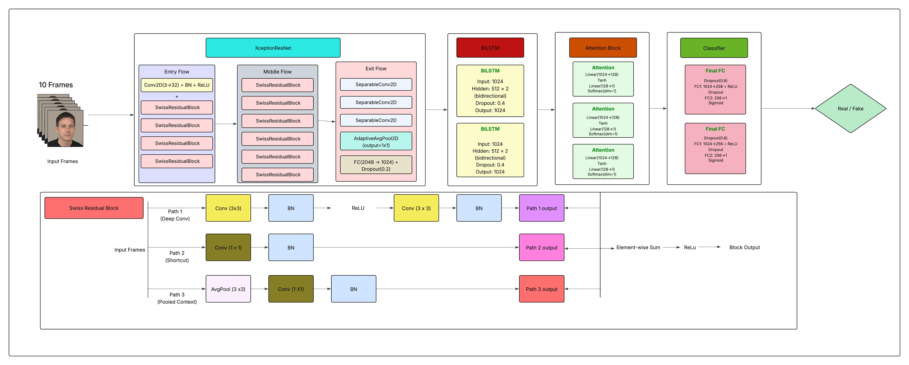
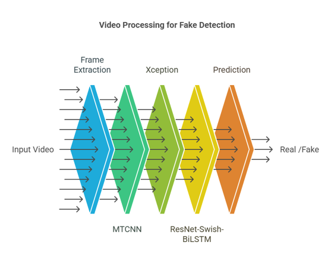
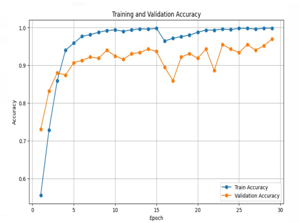
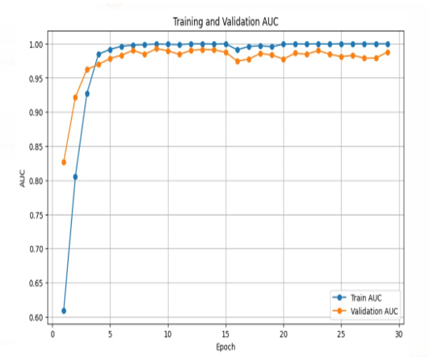
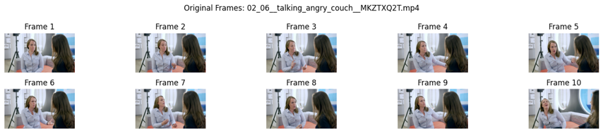
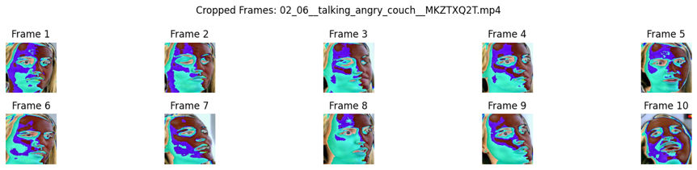

# DeepFake-Video-Detection

## Introduction
This project addresses the escalating threat posed by deepfake videos, leveraging cutting-edge deep learning techniques to develop a robust detection system. Deepfakes, synthetic media generated using artificial intelligence, can convincingly manipulate faces, voices, or bodies to depict individuals performing actions they never undertook. With applications ranging from entertainment to malicious activities such as misinformation and scams, the need for effective detection mechanisms is critical. This system aims to classify videos as either genuine or manipulated, supporting individuals, organizations, and platforms in maintaining trust in digital content. The development utilizes the 9 GB Meta DeepFake Detection Challenge (DFDC) dataset, comprising a rich collection of authentic and manipulated videos for training and evaluation.

## Understanding Deepfakes
A deepfake is an artificially created piece of media, including video or audio, produced through deep learning techniques. The term, a blend of "deep learning" and "fake," highlights its reliance on advanced AI to generate realistic content. While deepfakes have legitimate uses in entertainment and satire, their misuse—spanning misinformation campaigns, identity theft, privacy violations, and financial fraud—poses significant societal risks. As deepfake technology advances, detecting these manipulations becomes increasingly vital to preserve the integrity of digital media and protect public trust.

## Importance of Deepfake Detection
Deepfake detection is essential to mitigate the adverse impacts of synthetic media. It safeguards public safety by preventing misinformation, as exemplified by the 2022 deepfake video of the Ukrainian President falsely calling for surrender during the Russia-Ukraine conflict, which incited panic. It also protects privacy and reputation, addressing issues like the 2023 viral deepfake pornography of a Twitch streamer that caused emotional distress. Additionally, it combats financial scams, such as the 2024 Hong Kong firm losing $25 million due to a deepfake video call impersonating its CFO, and parental exploitation scams, where a Newfoundland family lost $10,000 in 2023 from a deepfake voice mimicking their son. Effective detection tools are thus necessary to uphold societal trust and security in an era of evolving digital threats.

## Proposed Methodology
The detection approach synergizes the strengths of XceptionNet and ResNet-Swish-BiLSTM architectures. XceptionNet excels in spatial feature extraction using depthwise separable convolutions but struggles with temporal inconsistencies and computational demands. ResNet-Swish-BiLSTM complements this by capturing temporal dynamics through Bidirectional LSTM layers, though it may lack fine-grained spatial detail and increases training complexity. This hybrid method overcomes the limitations of standalone models like Graph Neural Networks (GNN), which require complex graph construction, and VGG, which is computationally inefficient and prone to overfitting. The fusion leverages Xception’s spatial prowess and ResNet-Swish-BiLSTM’s temporal modeling to create a balanced, robust deepfake detection system.

## Dataset Description
The project employs the Meta DeepFake Detection Challenge (DFDC) dataset, a 9 GB collection designed for training and evaluating deepfake detection models. It includes a training set with a diverse mix of real and manipulated videos, a test set for unbiased performance assessment, and metadata detailing labels (real or fake) and original video references for manipulated content. Videos are approximately 10 seconds long, containing 300 frames at 30 frames per second (fps). The dataset’s structure supports comprehensive learning and validation, making it an ideal resource for developing and testing the proposed model.

## Preprocessing Pipeline

### Video Duration and Frame Sampling
Videos, lasting 10 seconds with 300 frames, are sampled to extract 10 frames, balancing computational efficiency with temporal coverage. This selection ensures key moments are captured without missing localized manipulations. Frames are extracted from the center of 10 equal 30-frame segments (e.g., frames 15, 45, 75, ..., 285) for uniform temporal representation.

### Face Extraction and Cropping
The Multi-task Cascaded Convolutional Networks (MTCNN) algorithm detects and crops facial regions from each of the 10 sampled frames, resizing them to 224x224 pixels. This focuses analysis on face areas where deepfake artifacts are prevalent, reducing background noise.

### Data Augmentation
A robust augmentation pipeline enhances model robustness and prevents overfitting. Techniques include random horizontal flipping (50% chance), rotation (±15 degrees), random cropping with resizing, and Gaussian noise addition to simulate real-world distortions. Images are converted to tensors and normalized using ImageNet statistics (mean=[0.485, 0.456, 0.406], std=[0.229, 0.224, 0.225]).

### Dataset Structure
Each video is represented as a sequence of 10 processed face images, labeled binary (0 for real, 1 for fake). The dataset is split into training, validation, and test sets to support model development and evaluation.

## Architectural Design

### Overview
The architecture processes sequences of 10 video frames, outputting a binary classification (real or fake) through hierarchical spatial-temporal analysis. Comprising approximately 30 layers, it integrates custom XceptionNet with Swiss Residual Blocks, Bidirectional LSTM, an attention mechanism, and classification layers.

### Spatial Feature Extraction
The custom XceptionNet, enhanced with Swiss Residual Blocks, employs depthwise separable convolutions and multi-path residual connections:

- **Entry Flow**: Four Swiss Residual Blocks increase channel dimensions from 32 to 728.
- **Middle Flow**: Six blocks maintain 728 channels for deep feature extraction.
- **Exit Flow**: Three separable convolutions expand channels to 2048, followed by global average pooling and a fully connected layer compressing to 1024 features per frame.
- **Swiss Residual Block**: Features three parallel paths—two 3x3 convolutions with residual connection, a 1x1 convolution for direct transformation, and average pooling with 1x1 convolution for broader context—blending ResNet’s residual learning with Xception’s efficiency.

*Figure: A diagram illustrating the proposed hybrid architecture, including the Custom XceptionNet with Swiss Residual Blocks, Bidirectional LSTM, Attention Mechanism, and Classification layers.*

### Temporal Analysis and Classification
- **Bidirectional LSTM**: Processes 1024-dimensional frame features with a 2-layer BiLSTM (512 units per direction), analyzing temporal dependencies bidirectionally and outputting 1024-dimensional vectors per frame.
- **Attention Mechanism**: Assigns importance weights to frame features, aggregating them via weighted summation to prioritize manipulation evidence.
- **Classification**: Two fully connected layers (1024→256→1) with 0.6 dropout regularize the attention-weighted BiLSTM output. Focal Loss with label smoothing handles class imbalance, while mixed precision training optimizes convergence.

## Training Methodology

### Input Processing
Input frames (batch_size × 10 × 3 × H × W) are processed by XceptionNet to yield 1024-dimensional embeddings capturing spatial artifacts like unnatural textures.

### Transfer Learning
Pre-trained weights from the timm library are loaded, with the first 11 blocks frozen to retain low-level ImageNet features, preventing overfitting on the imbalanced dataset. Subsequent layers are fine-tuned for deepfake-specific patterns.

### Forward and Backward Pass
The forward pass extracts spatial features with XceptionNet, feeds them into a 2-layer BiLSTM with attention, and classifies via fully connected layers. The backward pass computes gradients, optimized with mixed precision training (`torch.cuda.amp`) for efficiency.

### Optimization Techniques
- **Class Imbalance**: Focal Loss (alpha=0.75, gamma=2.0) prioritizes hard examples.
- **Overconfidence Prevention**: Label smoothing (0.1) enhances generalization.
- **Efficiency**: Mixed precision training uses FP16 for computation and FP32 for gradients.
- **Learning Rate**: `LinearWarmupScheduler` with `CosineAnnealingWarmRestarts` ensures stable convergence.
- **Regularization**: Dropout (0.4 in BiLSTM, 0.6 in classifier) mitigates overfitting.

## Performance Evaluation

### Metrics
- **Training Accuracy**: 99.8%
- **Validation Accuracy**: 97.01%
- **ROC-AUC Score**: 0.988

### Comparative Analysis
The proposed model (97.01%) outperforms the Standard Xception Model (94.5%), ResNet-Swish-BiLSTM (96%), and rivals the Pre-trained Xception + InceptionV3 + ResNet50 ensemble (98%), offering competitive accuracy with simpler architecture.

## Inference Process
The inference pipeline involves six steps:

1. **Frame Extraction**: Samples 10 frames (e.g., 15, 45, ..., 285) from 10-second videos.
2. **Face Cropping**: MTCNN crops and resizes faces to 224x224 pixels.
3. **Feature Extraction**: XceptionNet extracts 1024-dimensional spatial features.
4. **Temporal Analysis**: BiLSTM identifies temporal discrepancies.
5. **Classification**: The saved model outputs a binary result (0/1) with confidence.
6. **Output Visualization**: Displays 10 processed frames, prediction, and confidence.

*Figure: Original and post processed frames of sample inference video" from the report and "Original and Post Processed frames of Sample Inference Video*

## Technical Novelty

- **Hybrid Architecture**: Combines Xception’s spatial and BiLSTM’s temporal analysis, surpassing CNN-only models like MesoNet.
- **Optimized Frame Selection**: Uses 10 frames for efficiency and coverage.
- **MTCNN Preprocessing**: Enhances robustness with precise face cropping.

## Societal Benefits and Community Contribution

### Societal Impact
This system maintains public safety by detecting misinformation, safeguards privacy from non-consensual deepfakes, prevents parental exploitation scams, and mitigates financial fraud.

### Community Support
The model empowers communities with accurate detection (e.g., 96.23% on DFDC++), open-source tools, real-time applications for small entities, and integration with social media and law enforcement. It also supports policy advocacy and crowdsourced reporting to combat deepfake proliferation.

## Challenges and Limitations

- **Data Imbalance**: Excess fake samples bias the model, reducing real video accuracy.
- **Memory Issues**: Frame splitting causes high memory usage, risking crashes.
- **Frame Optimization**: Balancing frame count is critical to avoid missing cues or exhausting resources.
- **Overfitting**: Small datasets limit learning of complex patterns, affecting generalization.

## Conclusion
This project presents a novel hybrid deepfake detection system, achieving 97.01% validation accuracy and 0.988 ROC-AUC on the DFDC dataset. By addressing spatial and temporal discrepancies with an optimized architecture, it offers a balanced, efficient solution. Future research may explore adaptive frame selection, low-resource architectures, and detection of emerging deepfake techniques.

## References
1. Li, Y., et al., "Celeb-DF: A Large-scale Challenging Dataset for DeepFake Forensics," CVPR, 2020.  
2. Rossler, A., et al., "FaceForensics++: Learning to Detect Manipulated Facial Images," ICCV, 2019.  
3. Chollet, F., "Xception: Deep Learning with Depthwise Separable Convolutions," CVPR, 2017.  
4. Zhou, P., et al., "Two-Stream Neural Networks for Tampered Face Detection," CVPRW, 2017.  
5. Agarwal, S., & Farid, H., "Photo Forensics From JPEG Dimples," WIFS, 2017.  
6. Afchar, D., et al., "MesoNet: a Compact Facial Video Forgery Detection Network," WIFS, 2018.  
7. Ferrara, M., "Deepfake Zelensky surrender video is the latest form of war disinformation," The Conversation, 2022.  
8. Hao, K., "Deepfake porn is ruining women's lives. Now the law may finally ban it," MIT Technology Review, 2023.  
9. CBC News, "N.L. family loses $10K in voice cloning scam," CBC, 2023.  
10. Financial Times, "Hong Kong company loses $25m in deepfake video call scam," FT, 2024.  

---

## Resources and Data Access

All preprocessed data, including the **cropped facial images**, **sampled video frames**, and **model artifacts**, are organized and available in the shared Google Drive folder:

🔗 **[Access the resources here](https://drive.google.com/drive/folders/1S-fabYfWzQfpQdi9SBR45DUqBA7FAdgp?usp=sharing)**

This folder contains:
- Cropped face images used for training and inference.
- Sampled frames extracted from the videos.
- Output visualizations from inference runs.
- Additional supporting files required for replication or further research.

These resources ensure reproducibility and enable further experimentation by the research community.
